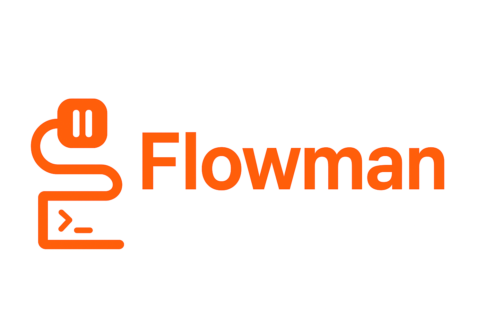

# Flowman CLI



Transform your Postman collections into powerful automated workflows with breakpoint control and interactive execution.

## Platform Support

**Currently supported:** Linux only

**Not supported:** Windows (support may be added in future releases)

## Installation

Install Flowman CLI globally using npm:

```bash
npm install -g flowman-cli
```

Or use it directly with npx:

```bash
npx flowman-cli
```

## Features

### Current Features ✓

- **Postman Authentication** - Secure login to your Postman account using API keys
- **Session Management** - Check authentication status and logout functionality
- **Interactive CLI** - Beautiful command-line interface powered by Clack prompts

### Roadmap 🚧

- **Workspace Sync** - Sync specific Postman workspaces to Git or using rsync
- **Workflow Creation** - Create and manage automated workflows from your Postman collections
- **Breakpoint Control** - Interactive execution with breakpoints for debugging
- **OAuth Authentication** - Browser-based OAuth login support

## Quick Start

### 1. Login to Postman

```bash
flowman-cli login
```

You'll be prompted to enter your Postman API key. Get your API key from [Postman Settings](https://web.postman.co/settings/me/api-keys).

### 2. Check Authentication Status

```bash
flowman-cli status
```

### 3. Logout

```bash
flowman-cli logout
```

## Requirements

- **Node.js**: Version 14.0.0 or higher
- **Platform**: Linux (Ubuntu, Fedora, Debian, etc.)
- **Postman Account**: Required for API access

## Commands

| Command | Description |
|---------|-------------|
| `flowman-cli login` | Login to your Postman account |
| `flowman-cli logout` | Logout from your Postman account |
| `flowman-cli status` | Check authentication status |
| `flowman-cli --help` | Display help information |
| `flowman-cli --version` | Show version number |

## Getting Your Postman API Key

1. Go to [Postman API Keys](https://web.postman.co/settings/me/api-keys)
2. Click "Generate API Key"
3. Give it a name and copy the key
4. Use it with `flowman-cli login`

## License

MIT © Hesham Adel

## Contributing

Contributions are welcome! Please feel free to submit issues and pull requests.
